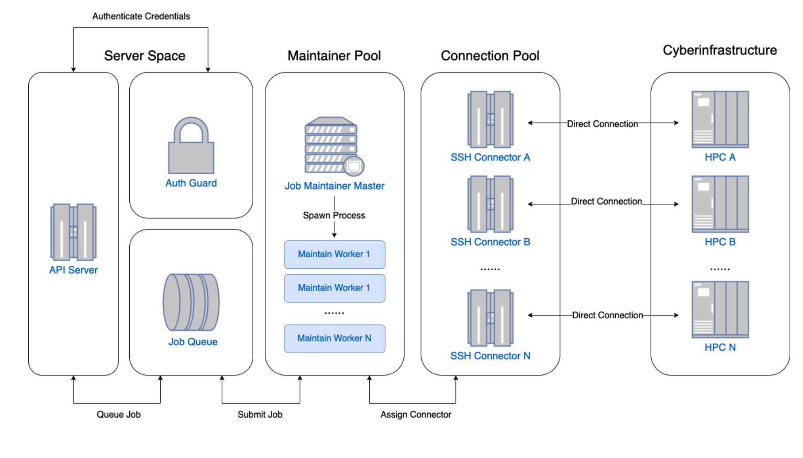

# CyberGIS Compute Core

Scalable middleware framework for enabling high-performance and data-intensive geospatial research and education on (CyberGISX)[https://cybergisxhub.cigi.illinois.edu].



Refer to `docs/lifecycle.md` for further information.

## CyberGIS Compute 

A scalable middleware framework for enabling high-performance and data-intensive geospatial research and education on CyberGIS-Jupyter

- CyberGIS Compute Core: middleware server that automates job submission to HPC.
- CyberberGIS Compute Python SDK: interactive client for Jupyter Notebook with code-less UI support.
- Contribution: developer API that enables model contribution with little to no modification for existing code.
- Supported Git Projects: https://cybergis.github.io/cybergis-compute-python-sdk/models.html

## Server Setup
1. External Software Installations
    - Docker & Docker Compose (https://docs.docker.com/engine/install/)
    - TablePlus for accessing MySQL (https://www.tableplus.com
    - npm package manager(https://docs.npmjs.com/downloading-and-installing-node-js-and-npm)

2. Pulling docker images and installing node-js packages. **From within the root of the repo, run:**

    ```bash
    #pull docker images
    docker pull jupyter/scipy-notebook:latest && docker pull alexandermichels/dummy-jupyterhub:0.0.2 && docker pull mitak2/slurm-docker-cluster:19.05.1 && docker pull mysql:5.7 && docker pull alexandermichels/cybergis-compute-core:latest && docker pull cybergisx/cybergisx:0.9.1
    git clone https://github.com/cybergis/cybergis-compute-local_hpc.git --recursive
    cd cybergis-compute-core
    # Install npm packages
    npm install && npm run build
    ```
    
3. Checking core configurations. Refer to [link](#-Configurations). This step may require sudo permissions (`sudo ./script/init.sh` or run as root.)
    ```bash
    # Check the configs in configs/ folder and if everything looks good run init script
    ./script/init.sh
    ```

3. Configure hpc parameters (Not required for Local HPC setup)
   - config.json
     - `local_key`
       - `private_key_path`
       - `passphrase` (if required)
   - configs/hpc.json
     - `external_key`
       - `private_key_path`
       - `passphrase` (if required)

4. Load relevant singularity image container
```bash
    mkdir -p local_hpc/user && cd local_hpc/user
    mkdir simages
    # Put your singularity container (e.g python.sif) inside simages
    # If you have access to keeling you can run the following command
    scp {enter your keeling id here}@keeling.earth.illinois.edu:/data/keeling/a/cigi-gisolve/simages/python.sif python.sif
```

5. The server is initialized using bash scripts. These bash scripts use docker compose to to run all of the containers. **Run these scripts from the root of your repo.**

  - Running the server
    ```bash
    # - run in foreground with log output
    ./script/develop-start-local.sh
    # - run in background, add -b background failing
    ./script/develop-start-local.sh -b
    ```
    - Checking that server is working alright. Make sure you allow 5 minutes for the server to fully initialize.
    ```bash
    # Fire up a new terminal and type
    docker container ls
    ```
    The output should be similar to 
    

    After all of the containers have started, run `bash script/setup_keys.sh` to configure passwordless SSH between the jobsupervisor and SLURM cluster.

    - Stop all running containers
    ```bash
    ./script/stop-local.sh
    ```

## Adding Github Repo to MySQL Server

- Creating MySQL connection in TablePlus (https://www.tableplus.com)

    - Name : Docker DB
    - Host : 0.0.0.0
    - User : slurm
    - Password : password
    - Port : 3306
    - Database : slurm_acct_db
    - SSL mode : DISABLED

- Adding hello world repo to MySQL server

    Once `Job` object is instantiated for the first time, a new table called gits is automatically created in the MySQL server. The following entries need to be filled in if we are interested in running `https://github.com/cybergis/cybergis-compute-hello-world.git`

        - id : hello_world
        - address : https://github.com/cybergis/cybergis-compute-hello-world.git
        - sha : NULL (DO NOT EDIT)
        - isApproved : 1
        - isCreatedAt : 1
        - isUpdatedAt : 1
        - isDeletedAt : NULL (DO NOT EDIT)


## JupyterHUB server (for Local HPC only)

Type ``localhost:443`` in your browser to open jupyter interface. Use ``admin`` as username and password. Follow the example at `examples/local_hpc/local_hpc_demo.ipynb`.

***

## Configurations

1. HPC configurations are located at `configs/hpc.json`
    - community account example
    ```json
    {
        "keeling_community": {
            "ip": "keeling.earth.illinois.edu",
            "port": 22,
            "is_community_account": true,
            "community_login": {
                "user": "cigi-gisolve",
                "use_local_key": false,
                "external_key": {
                    "private_key_path": "cigi-gisolve.key",
                    "passphrase": null
                }
              },
              "root_path": "/data/keeling/a/cigi-gisolve/scratch/dev"
        }
    }
    ```

    - private account example
    ```json
    {
        "hadoop": {
            "ip": "hadoop01.cigi.illinois.edu",
            "port": 50022,
            "is_community_account": false,
            "connector": "SlurmConnector"
        }
    }
    ```

    - local_hpc example
    ```json
        "local_hpc": {
        "ip": "slurmctld",
        "port": 22,
        "is_community_account": true,
        "community_login": {
            "user": "user",
            "use_local_key": false,
            "external_key": {
                "private_key_path": "/job_supervisor/keys/id_rsa",
                "passphrase": ""
            }
        },
        "root_path": "/home/user",
        "job_pool_capacity": 10,
        "globus": {
        },
        "init_sbatch_options": [
        ]
    }
    ```


2. Maintainer configurations are located at `configs/maintainer.json`
    - example maintainer with user upload file
    ```json
    {
        "SUMMA": {
            "hpc": ["keeling_community"],
            "job_pool_capacity": 5,
            "executable_folder": {
                "from_user": true,
                "file_config": {
                    "ignore": [],
                    "must_have": [
                        "summa_options.json",
                        "installTestCases_local.sh",
                        "data",
                        "output",
                        "settings"
                    ],
                    "ignore_everything_except_must_have": true
                }
            },
            "maintainer": "SUMMAMaintainer"
        }
    }
    ```

    - example maintainer that disables user upload
    ```json
    {
        "hello_world_singularity": {
            "hpc": ["local_hpc"],
            "job_pool_capacity": 5,
            "executable_folder": {
                "from_user": false
            },
            "maintainer": "HelloWorldSingularityMaintainer"
        }
    }
    ```
3. Core related service configs are located at `configs.json`
    - local hpc config example
    ```json
    {
        "local_key": {
            "private_key_path": "/dir/to/privatekey",
            "passphrase": null
        },
        "server_port": 3030,
        "server_ip": "0.0.0.0",
        "redis": {
            "host": "127.0.0.1",
            "port": 6379,
            "password": null
        },
        "mysql": {
            "host": "mysql",
            "port": 3306,
            "database": "slurm_acct_db",
            "username": "root",
            "password": "password"
        },
        "local_file_system": {
            "limit_in_mb": 100,
            "cache_path": "/job_supervisor/data/tmp",
            "root_path": "/job_supervisor/data/root"
        },
        "globus_client_id": "43a03cac-6eb2-4b77-91dd-6c08fc42f3d3",
        "queue_consume_time_period_in_seconds": 3,
        "is_testing": true
    }
    ```
## Debugging
    
1. `npm` related errors :
    Try removing `node_modules` and then reinstalling all
    of the packages
    ```bash
    rm -rf node_modules  # removes the modules
    npm install && npm build  # installes packages and builds core 
    ```

2. Database related issues:
   While the containers are running, execute the `register_cluster.sh` script
   ```bash
   . /local_hpc/register_cluster.sh
   ```


## Related Documentations
- [CyberGIS Compute Python SDK](https://github.com/cybergis/cybergis-compute-python-sdk)
- [CyberGIS Compute Example Hello World Project](https://github.com/cybergis/cybergis-compute-hello-world)

## Acknowledgements
- https://github.com/giovtorres/slurm-docker-cluster
